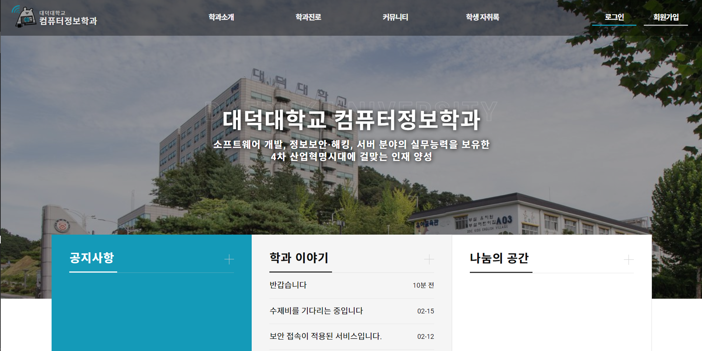
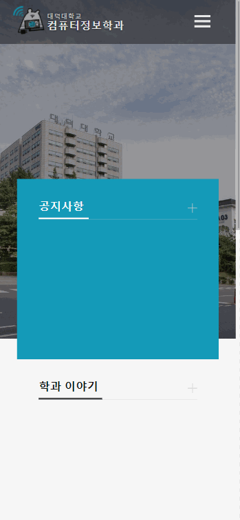
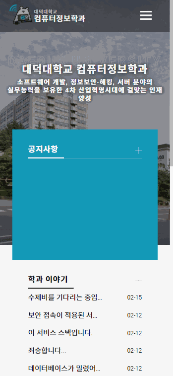
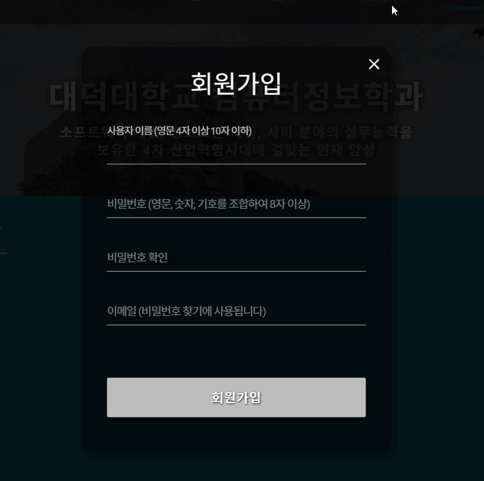

## 컴퓨터정보학과 웹 서비스
[>> 접속 경로 <<](https://www.ddccomputer.club)     
--- 

### 팀원
|이름|역할|
|:---|:---|
|최은기|백엔드 파트 - PM, AWS 관리|
|정지용|프런트엔드 파트 - 레이아웃, 컴포넌트 개발|
|김준재|프런트엔드 파트 - 웹팩 구축, 컴포넌트 개발|

### 화면
#### 로그인과 댓글달기 (mobile)

#### 글작성 (mobile)

#### 회원가입 (pc)

### 기술 스택
|이름|역할|
|:---|:---|
|React, TypeScript| 어드민 어플리케이션 개발 |
|Webpack|프런트 개발구조 및 웹 리소스 번들링 수행|
|Express.js|백엔드, RESTful API 개발|
|AWS EC2, Route53|외부 배포 및 도메인 연결 수행|
|NginX|리버스 프록시 서버 구성|

### 이 기능은 자랑하고 싶은데요
* RESTful API 방식의 게시판(CRUD) 및 페이지네이션
* NginX를 통한 리버스 프록시 서버
* 이메일 인증을 통한 비밀번호 변경
* PC, 모바일 반응형 디자인